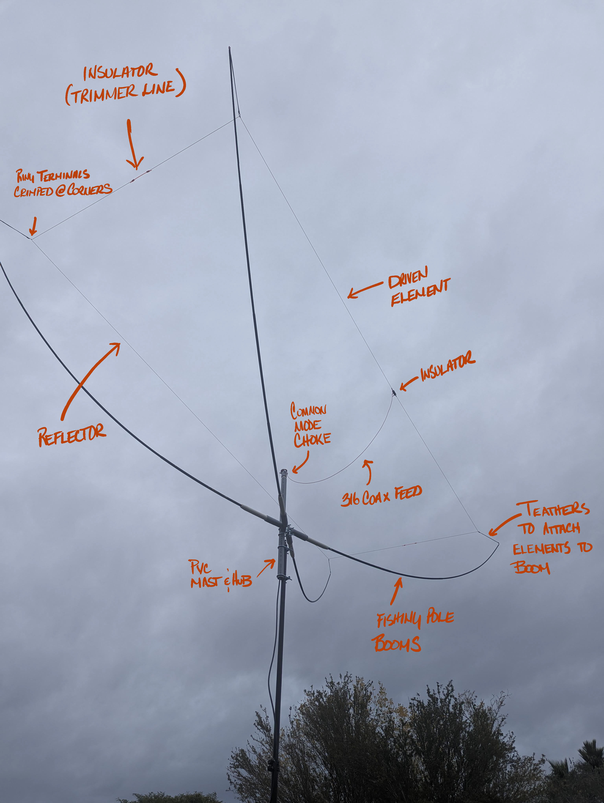
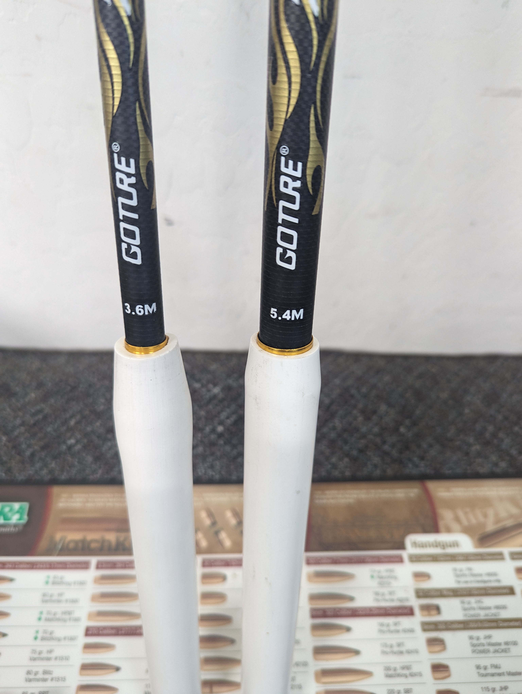
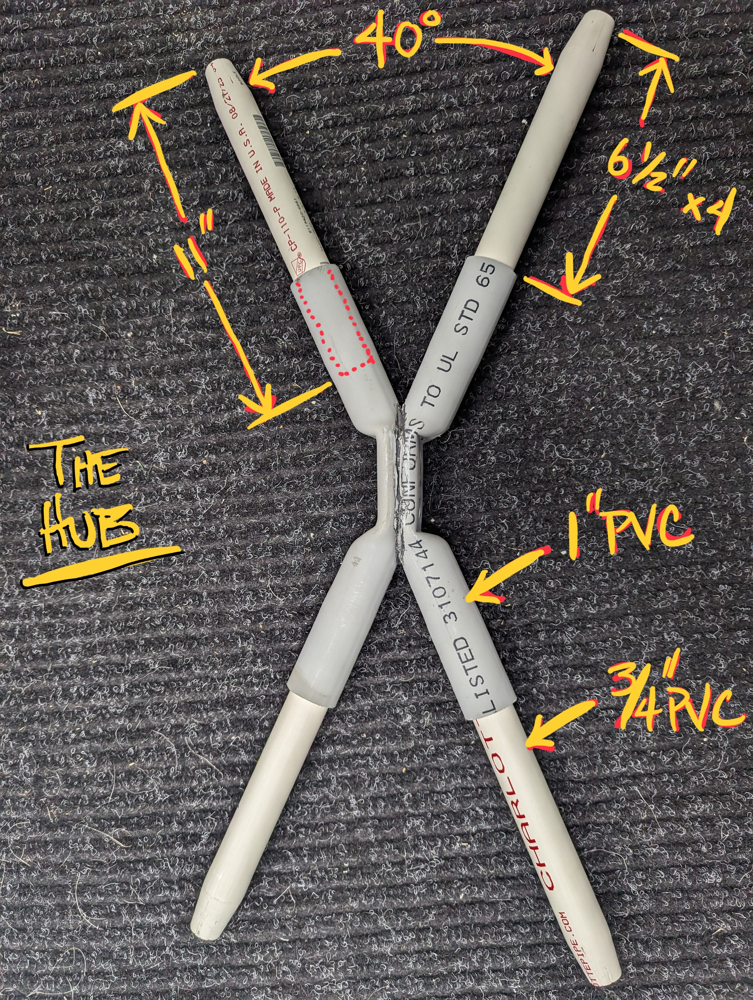
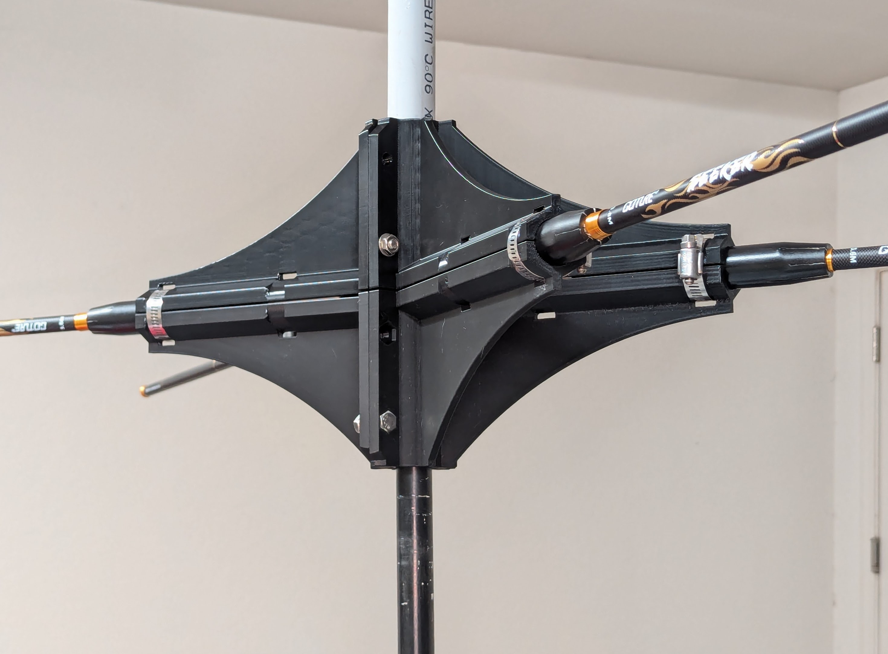
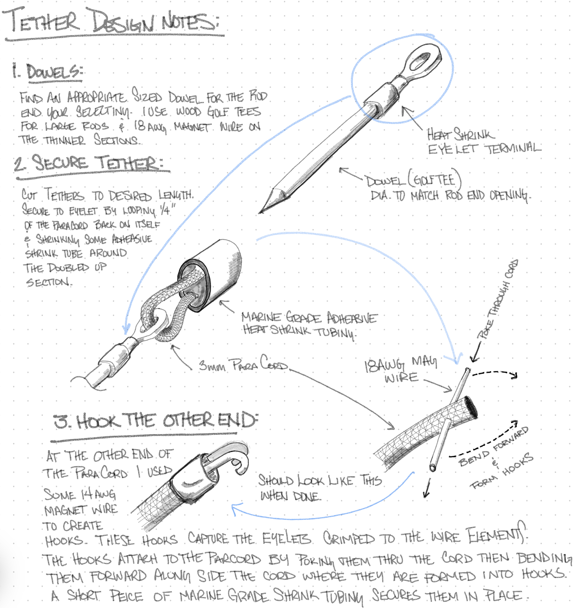
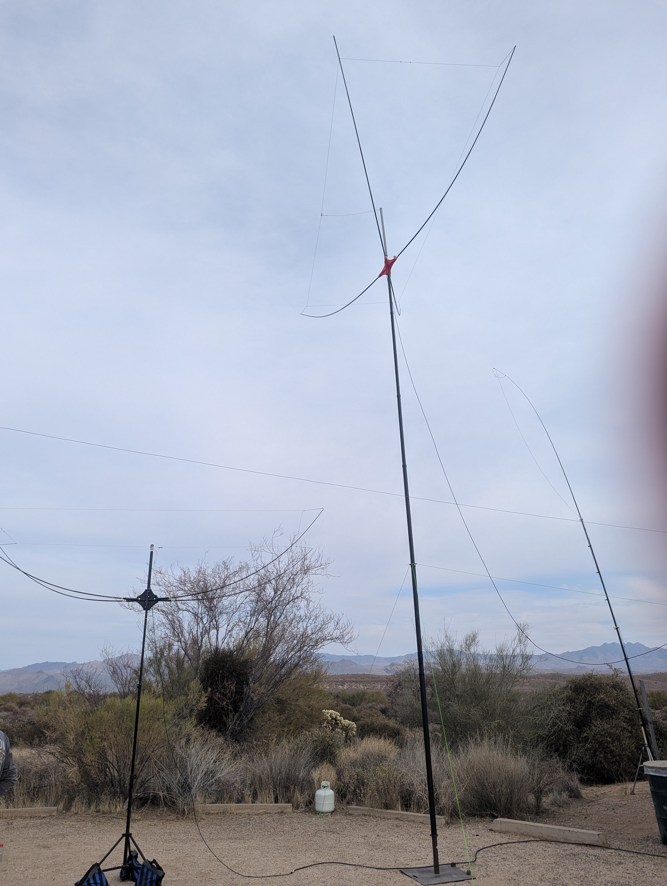

# YAMA 2.0: Yet Another Moxon Antenna

Welcome! This is my personal journey in crafting a budget-friendly, effective and protable antenna.

### The What
Before delving into the details, I realize not everyone who stumbles upon this page may be familiar with Moxon antennas - it's more common to find coding resources than antenna construction guides here. So, with the help of chatGPT, here's a simple explanation of a Moxon antenna:

>A Moxon antenna is a two-element directional antenna, primarily used for shortwave frequencies. It consists of a driven element and a slightly larger parasitic element, forming a rectangle with a small gap at the non-fed ends. This design offers several benefits: it has a compact size, provides good front-to-back ratio, and exhibits a directional radiation pattern. 

### The Why 
In the vast sea of internet resources, you'll find plenty of technical specifics and dimensions for building a proper Moxon antenna. However, converting those specifications into a physical entity is a different challenge. The key elements are the booms that support the antenna wire and the hub that aligns these booms in a 140-degree 'X' pattern. The existing designs online are varied, but none seemed to match the materials or tools I had on hand or could easily source. Therefore, I decided to contribute my own design approach to the online community, hoping it might aid others in their antenna-building endeavors.

### The Approach
My approach to the Moxon antenna is quite simple, using the common fishing pole method. What I find unique is the use of crimped eyelets on the antenna wire and tethers to connect them to the end of the fishing rods. This design allows for less accuracy in boom length and hub angle while still achieving a perfect rectangular antenna shape. To keep the antenna wire assembly lightweight, I used yard trimmer wire for the insulators. A small piece of poly tubing is used to secure the wire to the trimmer line. (I may replace this with shrink sleeve once I'm satisfied with the tuning.) Additionally, I added an integral common mode choke at the top of the mast.

### The How
### Parts List
1. 4x 3.6M telescopic fishing rods (the best I found were [GOTURE GOLDENLITE series](https://www.amazon.com/gp/product/B0C7CF2Y3W/ref=ppx_od_dt_b_asin_title_s00?ie=UTF8&th=1&psc=1))
2. 4x 11" sections of 3/4 SCH40 PVC
3. 2x 12" sections of 1" SCH40 PVC
4. 1x 36" Section of 1" SCH40 PVC
5. 1x 1x3" Ubolt

Tethers:

6. 4x 10" section of Paracord
7. 4x #10 Eyelet crimp terminals with adheasive lined shrink tubing 
8. 4x 3mmx40mm dowels (I used golf tees)
9. 4x 2" section of 18awg magnet wire (for forming wire hooks)

Elements:

10. 25'(approx) 26awg silicon wire (I really like [BNTECHGO 26 Gauge Silicone Wire](https://www.amazon.com/gp/product/B072829WN7/ref=ppx_yo_dt_b_search_asin_title?ie=UTF8&th=1) 
11. 3ft of 316 coax
12. 4x #10 Eyelet crimp therminals
13. 2x 6" sections of Trimmer line
14. 2x #10 Eyelet crimp terminals with adheasive lined shrink tubing 

#### The supports (boom)
For the supports I went with the common appoach of using japanese fishing rods. I tried several but found the [GOTURE GOLDENLITE series](https://www.amazon.com/gp/product/B0C7CF2Y3W/ref=ppx_od_dt_b_asin_title_s00?ie=UTF8&th=1&psc=1) to be the best. They are well constructed, thicker and stiffer than other poles of this type. I also like that their handles are ruberized with a metal ferrule which makes them eaisier to secure to the hub. Best of all they are cheap - I bought a two pack during black friday for $28 off Amazon. 
It is important to buy these longer than needed as the tip sections are really too thin to support the antenna wire. Removing the first 3 sections will get you down to the stiffer sections of the rod which reduces the overall length of the rod by 28-36". I went with a 12ft rod for my 10m moxon and a 18ft for the 20m version.

#### Adapters 
The hub will be constructed out of common pvc. (or 3d printed parts in the file list) To secure the rod to the hub, I made an adapter out of 3/4" pvc pipe swaged at one end to lock into the ferrule on the handle of the fishing pole. 
The handle on the 18ft poles fit like a glove into SCH80 3/4" pipe. The thin wall of SCH80 also make it really easy to swage. Swaging was accomplished with a heat gun an a small cocktail jigger. PVC starts to melt between 212-500 degrees fahrenheit so even a hair dryer could probably work. Just heat a small section of end of the pipe until soft then force into the taper of the jigger and let cool.

#### The Hub
To create the hub, I used two PVC pipes and placed them between two 2x4's. I heated the PVC pipes with a heat gun to make them soft and then pressed them together. The angles of the pipes don't need to be precise, especially since the tethers at the end of each rod provide flexibility. 

To ensure a secure fit, the ends of the 1" PVC were heated with a heat gun to enlarge them and allow the 3/4" PVC to fit inside. This provided a longer engagement between the adapter and hub, approximately 5 inches.
 

If you have a 3d printer with enough capacity you can print this un elegant, totally over engineered hub (read uses way too much filament). I made it to support a 20m version of the same antenna (it could probably handle a 40m if I could find the booms) in anycase I printed it in PETG with the center mast support facing down with support that should put most of the layer lines transverse to much of the stresses of the hub. I did use supports to keep the center hole from drooping. The hub is split into 4 symetrical pieces - I was able to print 2 parts at a time on my 10"x10"x10" bed. The hose clamps in the picture are probalby unnecessary once the hub is bolted to the center mast - there is nothing that wants to pull the booms out in normal use and there is more than enough engagement here. For a 10m moxon this hub design should be a third the size - but I already printed it so...

#### The Tethers
The tethers are my favorite part of this design. They simplify the attachment of the elements to the booms and their lengthis used to adjust the amount of tension/bend you put on the booms. I made my tethers based on my shortest element putting the most tension on the booms. The tension decreases as I move to the longer elements of other bands.

Here are both the 10M and 15M versions in action at Winter Field Day. 

